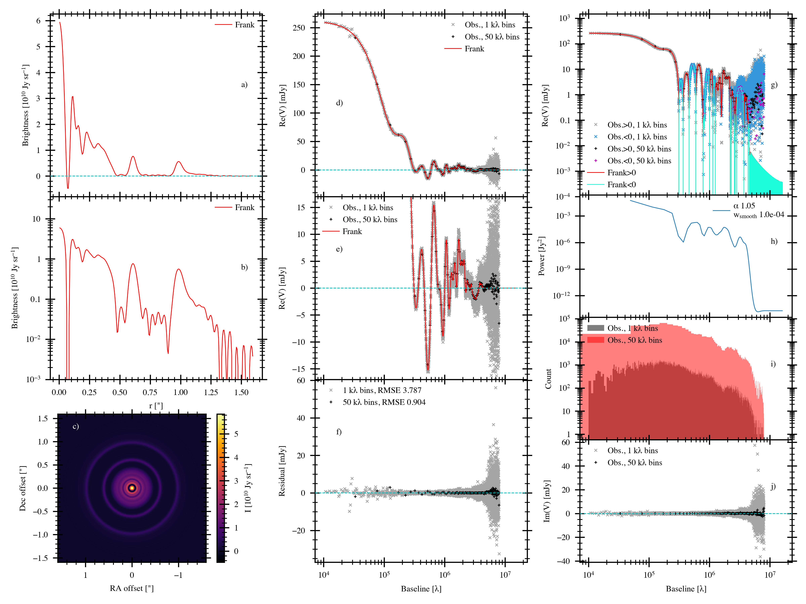
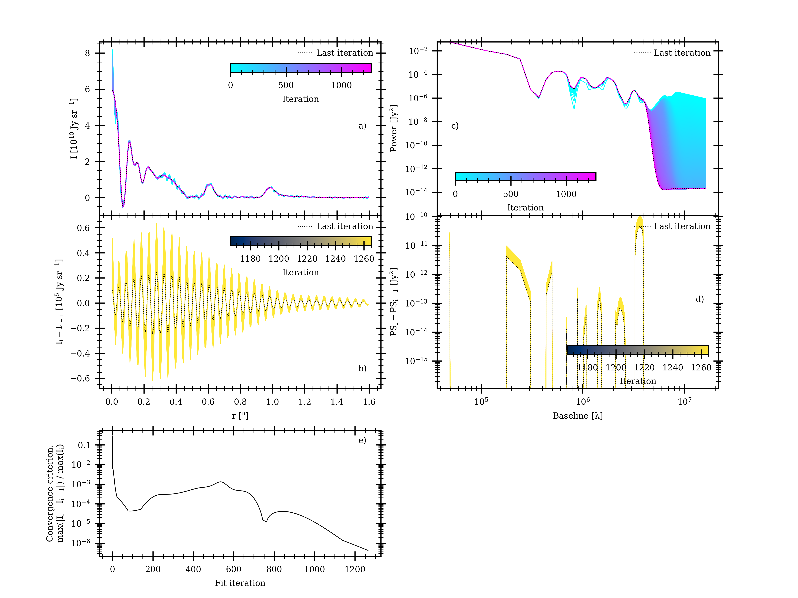
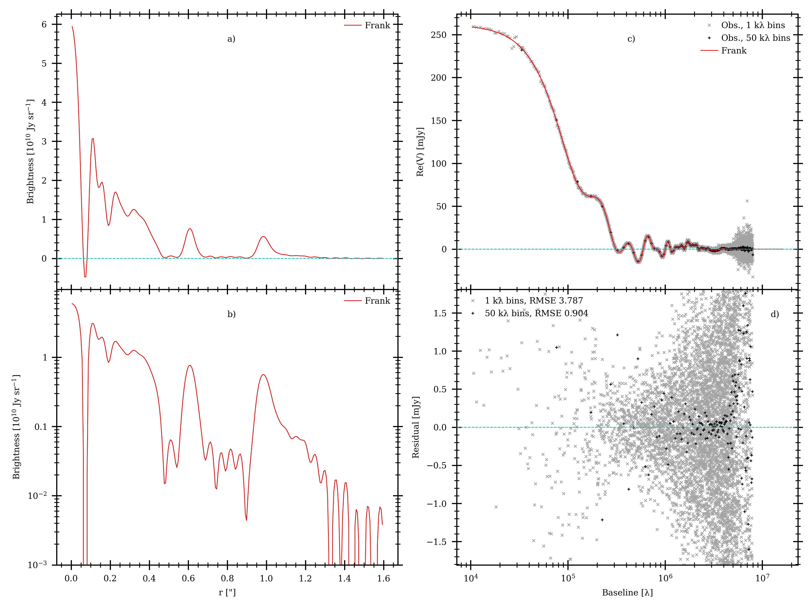

.. |br| raw:: html

     

Performing a fit
================

You can interface with Frankenstein (``frank``) to perform a fit in 2 ways:
**(1)** run the code directly from the terminal or **(2)** use the code as a Python module.

Perform a fit from the terminal
-------------------------------

To perform a quick fit from the terminal, only a UVTable with the data to
be fit and a *.json* parameter file (see below) are needed. A UVTable can be extracted
with CASA as demonstrated in `this tutorial <tutorials/xx>`_.
The column format should be `u [m]     v [m]      Re(V) [Jy]     Im(V) [Jy]     Weight [Jy^-2]`.

If you specify `load_dir`, `save_dir` and `uvtable_filename` in the default parameter file,
(see below for how to get a template parameter file) you can perform a fit using the default parameters with

.. code-block:: bash

    python -m frank.fit

where `-m` runs the `frank/fit` module as a script.

Alternatively you can leave any/all of the load directory, save directory and UVTable filename empty in the parameter file.
If so, the load directory will be set to your current working directory, the save directory to your load directory,
and you pass in the UVTable filename with the `-uv` option.

.. code-block:: bash

    python -m frank.fit -uv <uvtable_filename.txt>

If you want to change the default parameters, provide a custom parameter file with

.. code-block:: bash

    python -m frank.fit [-uv uvtable_filename.txt] -p <parameter_filename.json>

The default parameter file is ``default_parameters.json``. You can get it
`here <https://github.com/discsim/frank/blob/master/frank/default_parameters.json>`_,
and it looks like this:

.. literalinclude:: ../frank/default_parameters.json
    :linenos:
    :language: json

Note that anytime you run a fit without specifying `-p`, frank's internal `default_parameters.json` will be used.

You can get a description for each parameter with

.. code-block:: bash

    python -c 'import frank.fit; frank.fit.helper()'

which returns

.. literalinclude:: ../frank/parameter_descriptions.json
    :linenos:
    :language: json

That's it! By default frank saves (in `save_dir`) the parameter file you use as `frank_used_pars.json`,
the fitted brightness profile as `<uvtable_filename>_frank_profile_fit.txt`,
the visibility domain fit as `<uvtable_filename>_frank_vis_fit.npz`, UVTables for the **reprojected**
fit and its residuals as `<uvtable_filename>_frank_uv_fit.txt` and `<uvtable_filename>_frank_uv_resid.txt`,
and a figure showing the fit and its diagnostics as `<uvtable_filename>_frank_fit_full.png`.
Optionally frank can save a simpler version of this figure as `<uvtable_filename>_frank_fit_quick.png`.

Here's the full figure frank produces (if `full_plot=True` in your parameter file) for a fit to the DSHARP continuum observations of the protoplanetary disc
AS 209 (`Andrews et al. 2018 <https://ui.adsabs.harvard.edu/abs/2018ApJ...869L..41A/abstract>`_).

**a)** The fitted frank brightness profile. |br|
**b)** As in (a), on a log scale. The oscillations below :math:`\approx 10^9\ {\rm Jy\ sr}^{-1}` indicate the fit's noise floor. |br|
**c)** The frank profile swept over :math:`2\pi`. Note this image is not convolved with any beam. |br|
**d)** The visibility domain fit and the data in 1 and 50 :math:`{\rm k}\lambda` bins. |br|
**e)** As in (d), zooming on the longer baselines. |br|
**f)** Residuals between the binned data and the fit. The residuals' RMSE is given in the legend;
note this is being increased by the residuals beyond the baseline at which the fit walks off the data. |br|
**g)** As in (d), on a log scale. The positive and negative data and fit regions are distinguished since this is a log scale. |br|
**h)** The fit's reconstructed power spectrum, the prior on the fitted brightness profile.
To see how this the fit to this dataset is sensitive to the prior, check out `this notebook <tutorials/prior_sensitivity_and_uncertainty.ipynb>`_. |br|
**i)** The (binned) imaginary component of the visibilities. frank only fits the real component, so if Im(V) is large,
it could indicate xx asymmetry in the disc xx that frank will average over.

Test a fit's convergence
########################
Just to be safe, it's always good to check how well a fit has converged. Using the fit from the above figure,

**a)** The fitted frank brightness profile over all fit iterations.
Note how small amplitude, fast oscillations ('ringing') that are due to unconstrained
baselines are damped over the first :math:`\approx 300` iterations.
The fit runs until a convergence criterion on the power spectrum is met at every collocation point,
:math:`|(P_{\rm i} - P_{\rm i-1}| <= {\rm tol} * \pi`,
where :math:`P_{\rm i}` is the power spectrum at iteration :math:`i`
and :math:`{\rm tol}` is the tolerance (`iter_tol`) in your parameter file.
This criterion is more robust than one on the brightness profile because of the oscillations imposed on the latter by the visibilities' sparse sampling.
If this stopping condition is not met, the fit runs until `max_iter` as set in your parameter file. |br|
**b)** Sequential difference between the last 100 brightness profile iterations.
Note the y-scale here is :math:`10^5\ {\rm Jy\ sr}^{-1}`, as opposed to :math:`10^{10}\ {\rm Jy\ sr}^{-1}` in (a).
So in this case the oscillations remaining at the end of the fit (:math:`\approx 1250` iterations) are at a part in :math:`10^6`.
|br|
**c)** The reconstructed power spectrum over all fit iterations.
Our initial guess for the power spectrum, a power law with slope of -2, is apparent in the longest baselines for the first :math:`\approx 250` iterations,
and then we continue iterating to suppress the high power placed at the data's noise-dominated, longest baselines. |br|
**d)** Sequential difference between the last 100 brightness profile iterations.
Note the y-scale here is small compared to (b),
and the largest variation is at the baseline where the fit walks off the visibilities. |br|
**e)** A simple metric for the brightness profile's convergence, :math:`{\rm max}(|(I_{\rm i} - I_{\rm i-1}|)\ /\ {\rm max}(I_i)`,
where :math:`I_i` is the brightness profile at iteration :math:`i` and :math:`{\rm max}` entails the largest value across all collocation points.
In this case the largest variation across all collocation points at the last iteration is thus at a part in :math:`10^6` of the profile's peak brightness, consistent with (b).
We want to ensure this convergence metric isn't going start increasing again if we iterate for longer, so we wouldn't have wanted to stop at iteration :math:`\approx 750`,
while by iteration :math:`\approx 1000` the trend looks good. frank's internal stopping criterion for the fit, as described above in (a), is not yet met at
iteration 1000, as that criterion is conservative to help ensure the power spectrum (and thus the brightness profile) is no longer appreciably changing.

Perform multiple fits in a loop
###############################
You can run multiple fits in a single call to frank (e.g., to check a fit's sensitivity to hyperpriors or run a self-consistent analysis on multiple sources)
by setting one or more of the parameters in the parameter file as a list.
See `this tutorial <tutorials/running_fits_in_a_loop.ipynb>`_ for an example.

Modify the `fit.py` script
##########################
We've run this example using `fit.py`; if you'd like to modify this file, you can get it `here <https://raw.githubusercontent.com/discsim/frank/master/frank/fit.py>`_.
For an 'under the hood' look at what this script does, see `this tutorial <tutorials/using_frank_as_a_module.ipynb>`_.
And if you'd like a more qualitative overview of the script (with sound), see `here <https://www.youtube.com/watch?v=xMxsLKQidY4&t=5>`_.

Perform a fit using `frank` as a Python module
-----------------------------------------------

To interface with the code more directly, you can use it as a module.

Let's first import some basic stuff from frank and load the data
(again using the DSHARP observations of AS 209, available as a UVTable
`here <https://github.com/discsim/frank/blob/master/tutorials/AS209_continuum.txt>`_).
Note that the wrapper functions in ``fit.py`` can do all this for us; of those,
here we're not using `parse_parameters` because we'll explicitly pass the parameters we need,
and we're also not using `determine_geometry` or `perform_fit`
just to show how to directly interface with the code's internal classes.

.. code-block:: python

    import os
    from frank.radial_fitters import FrankFitter
    from frank.geometry import FitGeometryGaussian
    from frank.fit import load_data
    from frank.make_figs import frank_plotting_style, make_quick_fig
    from frank.io import save_fit

    uvtable_filename = 'AS209_continuum.txt'
    u, v, vis, weights = load_data(uvtable_filename)

Now run the fit using the `FrankFitter <https://github.com/discsim/frank/blob/master/frank/docs/_build/html/py_API.html#frank.radial_fitters.FrankFitter>`_ class.
In this example we'll ask frank to fit for the disc's geometry using the `FitGeometryGaussian <https://github.com/discsim/frank/blob/master/frank/docs/_build/html/py_API.html#frank.geometry.FitGeometryGaussian>`_ class.
`FrankFitter <https://github.com/discsim/frank/blob/master/frank/docs/_build/html/py_API.html#frank.radial_fitters.FrankFitter>`_ will then deproject the visibilities
and fit for the brightness profile. We'll fit out to 1.6" using 250 collocation points and the code's default ``alpha`` and ``weights_smooth`` hyperprior values.

.. code-block:: python

    FF = FrankFitter(Rmax=1.6, N=250, geometry=FitGeometryGaussian(),
                     alpha=1.05, weights_smooth=1e-4)

    sol = FF.fit(u, v, vis, weights)

Now we'll just make a simplified figure showing the fit (with only subplots (a), (b), (d), (f) from the figure above;
when running from the terminal, frank produces this figure if `quick_plot=True` in your parameter file),

.. code-block:: python

    make_quick_fig(u, v, vis, weights, sol, bin_widths=[1e3, 5e4], force_style=True)

which gives this figure,

And finally we'll save the fit results.

.. code-block:: python

    save_fit(u, v, vis, weights, sol, save_dir=os.getcwd(),
            uvtable_filename=os.path.splitext(uvtable_filename)[0],
            save_profile_fit=True, save_vis_fit=True, save_uvtables=True
            )
